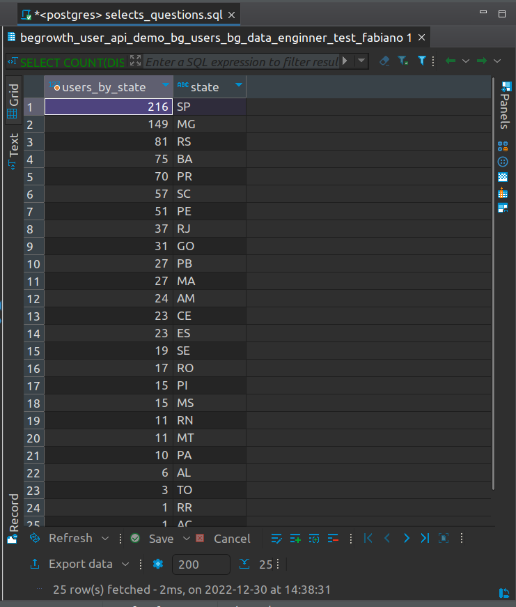
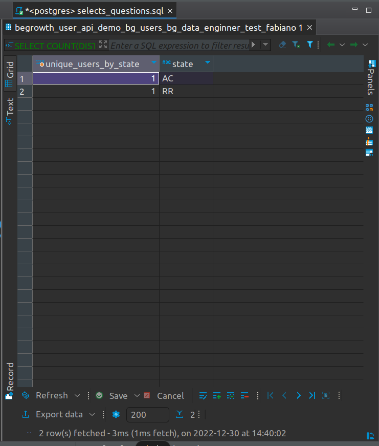
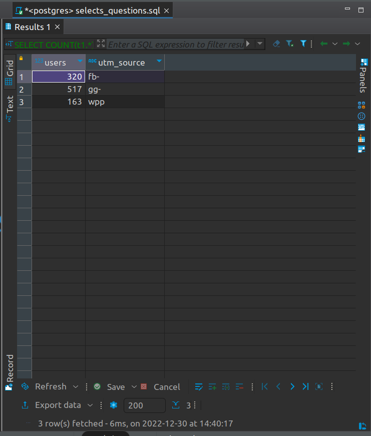
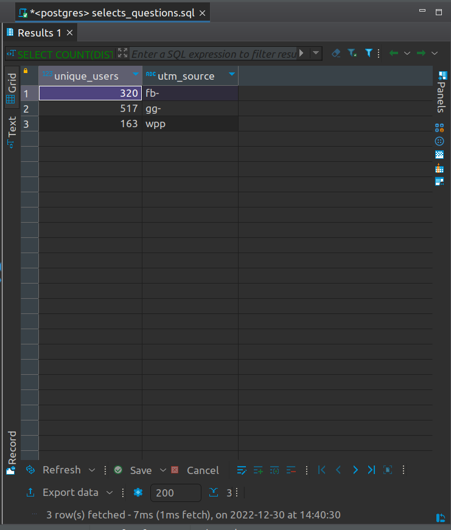
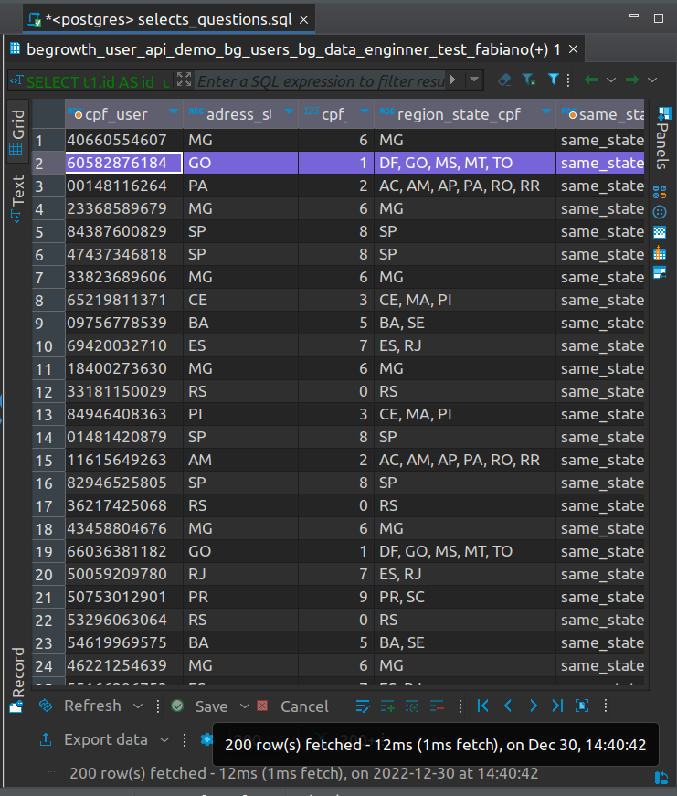

# :rocket: Desafio
Nosso time de negócio precisa analisar dados de alguns usuários para tomada de decisões futuras

O desafio é capturar os dados que recebemos de alguns usuários e conseguir responder perguntas que definirão os próximos passos da empresa!
 
# Tarefas

## Preparação do ambiente:

Criei um notebook no Jupyter com o nome data_engineer_test_fabiano.ipynb.

Procedimento necessário para fazer os scripts Python e colocar as considerações.

Arquivo está na raiz do projeto.

## Criar um ambiente virtual e instalar todos os pacotes Python, via pip install.

Aqui é assumido que o python e o gerenciador de pacotes pip já estão 
instalados e funcionando em seu ambiente.


## Criando um ambiente virtual:
    python -m venv .venv

## Ativando o ambiente virtual Python:
    source .venv/bin/activate

## Os pacotes Python, podem ser instalados usando com requirements.txt, na mesma pasta do script:
    pip install -r requirements.txt

O arquivo references.txt contém algumas referências e sites que usei para
criar o script e também para fazer as queries.

## Importar bibliotecas que foram instaladas via pip
    import requests
    import json
    import pandas as pd
    from pandas.io.json import json_normalize
    import numpy as np
    import geopy
    from geopy.geocoders import Nominatim
    from geopy.point import Point
    from cryptography.fernet import Fernet
    from datetime import datetime
    from google.oauth2.service_account import Credentials
    from google.oauth2 import service_account
    import google.auth
    from google.auth.transport.requests import AuthorizedSession
    from google.cloud import bigquery
    from google.oauth2 import service_account
    import pandas_gbq as gbq


### 1. Cadastrar usuário para obter token de acesso da API :key:

**Request Address**: `https://begrowth.deta.dev/user/`

**Request Method** `POST`

**Request Parameters JSON**:
```
{
  "full_name": "string",
  "email": "user@example.com"
}
```

Preencha `full_name` com seu nome completo e `email` com seu email


**Curl**
```
curl -X 'POST' \
  'https://begrowth.deta.dev/user/' \
  -H 'accept: application/json' \
  -H 'Content-Type: application/json' \
  -d '{
  "full_name": "Joao Henrique",
  "email": "joao@begrowth.com.br"
}'
```
------
**Server response**

Code: **201**
Response Body: 
``` 
{
  "user": "joao@begrowth.com.br",
  "API Token": "{access_token}"
}
```

## Gerar um token para acessar a API
O token para acessar a API da begrowth é fornecido após cadastrar um
usuário.

Informar os dados Nome e E-mail nos campos full_name e email.
      
Após fazer um request, é retornado o usuário e o token para acessar a API.
     
Por fim, imprime na tela o json obtido.


    headers = {
        'accept': 'application/json',
        'Content-Type': 'application/json',
    }

    json_data = {
        'full_name': 'Fabiano Moreira Alves',
        'email': 'fabianomalves@proton.me',
    }

    access_token = requests.post('https://begrowth.deta.dev/user/', headers=headers, json=json_data)
    access_token_json = access_token.json()

    print(access_token_json)


## Separando o usuário e o token para acessar a API
Como o request retorna um json(dicionário) é preciso separar o dicionário
e pegar somente a informação do token.
    
Após isso, imprime na tela somente o token.

    keys = []
    values = []
    items = access_token_json.items()
    for item in items:
        keys.append(item[0]), values.append(item[1])
    
    string_acess_token = str(values[-1])
    print(string_acess_token)


### 2. Consumir dados de usuário da API :key:
Substituindo `access_token` pelo token obtido na etapa anterior, podemos chamar o endpoint `https://begrowth.deta.dev/token=access_token` que nos retorna dados de usuários em formato **JSON**

Exemplo:
**Saída**
```
    {
        "id": 125,
        "first_name": "João",
        "last_name": "Almeida",
        "email": "joao@exemplo.br",
        "gender": "Male",
        "address": {
            "geo_latitude": -28.2588438,
            "geo_longitude": -53.5009992,
            "country": "Brazil"
        },
        "utm": "br-gg-cc",
        "cpf": "gAAAAABjieY90eD1zlPMbL92LLt-f6j5-apLacUZRGPncA9xDS99y1GunWtI9X2OfzMRsjDwNOk7Kya1Zd6l7WmcfJBUpqCIbw=="
    }
```


| Campo | Descrição |
| :---  | :---      |
| **ID**| identificador único do usuário |
| **first_name** | primeiro nome do usuário |
| **last_name** | último nome do usuário |
| **email** | email que o usuário cadastrou |
| **address** | dados de acesso do usuário |
| **address.geo_latitude** | latitude de acesso do usuário |
| **address.geo_longitude** | longitude de acesso do usuário |
| **address.country** | país de acesso do usuário |
| **utm** | define o fluxo de acesso (**vide legenda abaixo**) |
| **cpf** | CPF criptografado do usuário |


Para o campo **utm** (Urchin Traffic Monitor) temos os seguintes dominios validos, que sempre terá a estrutura [país]-[source]-[vertical]:

`br-gg-emp, br-gg-cc, br-gg-fin, br-fb-emp, br-fb-cc, br-wpp-fin`

**Legenda:**


| sigla | País      |
| :---  | :---      |
|**br** | Brazil    |


| sigla   | Source   |
| :---    | :---     |
|**gg**   | Google   |
|**fb**   | Facebook |
|**wpp**  | WhatsApp |


| sigla   | Vertical          |
| :---    | :---              |
|**emp**  | Emprestimo        |
|**cc**   | Cartão de Credito |
|**fin**  | Financiamento     |


**Exemplo:**

O `utm = br-fb-emp` significa que o usuário pertence ao:
* País = br = Brazil
* Source = fb = Facebook
* Vertical = emp = Emprestimo

## Consumir a api, chamando-a e passando o token adquirido

Concatenando a url https://begrowth.deta.dev/token=access_token, junto do
token obtido é necessário para acessar os dados da API.

Para isso, concatenei a url com o token obtido anteriormente e salvei numa
variável.
    
Exibindo a url, concatenando com o token obtido.

Depois disso, salvar a url com o token obtido na variável
url_dev_with_token

Imprime a variável na tela

    url_dev = "https://begrowth.deta.dev/token="
    url_dev_with_token = url_dev + string_acess_token
    print(url_dev_with_token)


## Normalizar o json recebido pelo request, inserindo ele num dataframe Pandas
Como os dados do obtidos pelo requests são um json, 
foi feita uma "normalização" dos dados e foi inserido num dataframe.

Processo feito para trabalhar melhor com os dados, principalmente com campo
address, que contem outro dicionário dentro da estrutura do json.
    
Exibindo as primeiras linhas do dataframe.


    data = json.loads(requests.get(url_dev_with_token).text)
    df_json_normalize = pd.json_normalize(data)
    df_json_normalize.head()


### 2. Transformar e tratar os dados em um dataframe com Python
Para ajudar o time de produto em suas análises, precisamos que os dados estejam formatados e com seu data type correto
 
**Regras de negócio**
* **2.1 -** Precisamos saber o estado que a pessoa acessou nossos serviços, com as coordenadas `address.geo_latitude` e `address.geo_longitude` dos usuários devemos criar uma coluna de estado chamada `address_state`, processo denominado [reverse geocode](https://en.wikipedia.org/wiki/Reverse_geocoding)
* **2.2 -** a API nos devolve o CPF do usuário, mas temos um problema: o CPF está **criptografado**! :lock: Utilizando a chave de criptografia **Fernet** passada por email, abra esse CPF para que possamos analisar o próximo requisito; :unlock:
* **2.3 -** Para ajudar a identificar registros mais atualizados e para nosso controle de auditoria, precisamos que o dataframe tenha as colunas `dt_insert` que contenha data/hora de inclusão do registro e `candidate_name` que contenha seu nome


## Procurando linhas duplicadas:
Ao exibir as primeiras linhas do dataframe, já exibiam algumas linhas
duplicadas. 
    
Filtrando os duplicados pelo id dos usuários e retornando 
todos os duplicados, já fazendo uma limpeza nos dados.

    duplicate_rows = df_json_normalize[df_json_normalize.duplicated(['id', ])]
    print(duplicate_rows)

## Removendo as linhas duplicadas
Efetuando um drop nas linhas duplicadas, filtrando pelo 'id' e salvando
em outro dataframe.

Depois exibe somente as linhas distintas.

    df_distinct_id_rows = df_json_normalize.drop_duplicates(subset=['id'])
    print(df_distinct_id_rows)

## Fazendo um reverse geocoding 
Após normalizar os dados, foram criados 3 novos campos, 
destrinchando o campo address.

Campos address.geo_latitude, address.geo_longitude, address.country

Para conseguir a informação do estado, é necessário o processo 
de reverse geocoding, onde pegamos a latitude e longitude e 
filtramos as informações que queremos,no caso o estado. 

Porém, verifiquei que os nomes dos estados apresentam acentos, 
o que é um problema na hora de fazer os selects.

Para isso, peguei o campo ISO 3166-2, que é um padrão mundial de siglas
por estados, gerando o padrão BR-UF.

Como teremos os UFs, será melhor para fazer os selects.

    # Create a geocoder object using the Nominatim API
    geolocator = Nominatim(user_agent="my_geocoder_state")

    # Define a function to reverse geocode the state
    def get_state(lat, lng):
      # Use the geocoder object to reverse geocode the coordinates
      location = geolocator.reverse((lat, lng))
      # Extract the state code from the response, using ISO3166-2-lvl4
      state = location.raw['address']['ISO3166-2-lvl4']
      return state

    # Apply the function to each row of the DataFrame and store the result in a new column

    df_distinct_id_rows.loc[:, ['address_state']] = df_distinct_id_rows.apply(lambda x: get_state(x['address.geo_latitude'], x['address.geo_longitude']), axis=1)


    # Display a resulting DataFrame
    df_distinct_id_rows.head()


## Salvando o novo dataframe num arquivo csv.
Como o processo de reverse geocodin demora demais, 
salvei o dataframe localmente, para não demorar muito, 
caso fosse necessário rodar novamente o script.

Consigo trabalhar a partir desse ponto em diante com o arquivo csv,
caso necessário.

    df_distinct_id_rows.to_csv('./data/df_distinct_id_rows.csv', index=False)


## Descriptografar o campo CPF
O campo CPF está criptografado, pela criptografia Fernet.
    
Para isso, é necessário usar a chave Fernet, passada por e-mail.

    fernet = Fernet(b'ekkxXo0uHWRkIbHqHrLS4gaMj2hWTYMJyPTAbi9INGI=')

    df_distinct_id_rows['cpf'] = df_distinct_id_rows['cpf'].apply(lambda x: fernet.decrypt(x.encode()))

    df_distinct_id_rows.head()


## Salvando o arquivo descriptografado num csv

    df_distinct_id_rows.to_csv('./data/df_decrypt_cpf.csv', index=False)


## Lendo o arquivo csv, cujo cpf foi descriptografado.

    df_decrypt_cpf = pd.read_csv('./data/df_decrypt_cpf.csv' )
    df_decrypt_cpf.head()

## Formatando a coluna CPF
Após descriptografar o cpf, a coluna ficou um b de byte, 
oriundo da chave de descriptografar.

Fazendo a remoção das informações que são desnecessárias.

    df_decrypt_cpf['cpf'] = df_decrypt_cpf['cpf'].apply(lambda x: x[2: -1])
    df_decrypt_cpf.head()

## Salvando o arquivo descriptografado e formatado num csv

    df_decrypt_cpf['cpf'] = df_decrypt_cpf['cpf'].astype(str)
    df_decrypt_cpf.to_csv('./data/df_decrypt_formatting_cpf.csv', index=False)


## Lendo o arquivo csv, descriptografado e formatado e transformando num df
Como o campo CPF poderia ficar desformatado, efetuei a leitura, informando
que o tipo de dados no campo CPF é uma string.

    df_decrypt_formatting_cpf = pd.read_csv('data/df_decrypt_formatting_cpf.csv', dtype={'cpf': str})
    print(df_decrypt_formatting_cpf.head(20))

## Removendo o prefixo "BR-" da coluna address_state
Para deixar a coluna mais clean, manter somente as UFs no campo address_state
Procedimento necessário, pois no reverse geocoding, gerou a tabela 
address_state com o padrão BR-UF.

    df_decrypt_formatting_cpf["address_state"] = df_decrypt_formatting_cpf["address_state"].str.replace("BR-", "")
    df_decrypt_formatting_cpf.head()

## Inserindo colunas dt_insert e candidate_name
Inserindo as colunas dt_insert e candidate_name
conforme solicitado e prenchendo com um timestamp e o nome.

    # Create a variable now, with the actual timestamp
    now = datetime.now()

    # Create new columns
    df_decrypt_formatting_cpf = df_decrypt_formatting_cpf.assign(
        dt_insert=now,
        candidate_name='Fabiano Moreira Alves'
    )

    df_decrypt_formatting_cpf.head()

## Alterar os nomes das colunas, inserindo um '_' ao invés de '.'
Removendo os pontos dos nomes das colunas e trocando por underscores.
Processo necessário para inseir os dados no Google BigQuery.

    df_decrypt_formatting_cpf = df_decrypt_formatting_cpf.rename(columns=lambda x: x.replace('.', '_'))

    df_decrypt_formatting_cpf.head()

## Salvando o dataframe após as transformações.

    df_decrypt_formatting_cpf['cpf'] = df_decrypt_formatting_cpf['cpf'].astype(str)
    df_decrypt_formatting_cpf.to_csv('./data/bg_data_enginner_test_fabiano.csv', index=False)


df = pd.read_csv('./data/bg_data_enginner_test_fabiano.csv', dtype={'cpf': str})


### 3. Inserir esse dataframe dentro de uma tabela no BigQuery
Deixamos os dados no jeitinho para que eles possam ser armazenados dentro de uma tabela na nossa base de dados.
Utilizando a **service account** enviada por email crie a tabela no banco de dados com a seguinte nomenclatura **begrowth-user-api-demo.bg_users.bg_data_enginner_test_seuNome**

* **project_id =** begrowth-user-api-demo
* **dataset_id =** bg_users
* **table_id   =** bg_data_enginner_test_seuNome


**Ponto de atenção**: *o BigQuery não aceita colunas com ponto ou caracter especial, precisaremos renomear as colunas que contenham alguns desses casos trocando-os por *underscore* `_`*

## Conectar no big query e fazer um select
### Tabela: bg_users.brazilian_state

    project_id = 'begrowth-user-api-demo'
    dataset_id = 'bg_users'

    # Set the path to your service account file
    service_account_file = '/home/fabiano/Projects/data_engineer_test/svc-data-engineer-test.json'

    # Load the service account credentials from the file
    credentials = service_account.Credentials.from_service_account_file(service_account_file)

    # Create a BigQuery client using your service account credentials
    client = bigquery.Client(credentials=credentials, project=project_id)

    sql = """
    SELECT 
        *
    FROM 
    begrowth-user-api-demo.bg_users.brazilian_state
    """
    df_begrowth_user_api_demo_bg_users_brazilian_state = gbq.read_gbq(sql, project_id = project_id, credentials=credentials, progress_bar_type=None)

    print(df_begrowth_user_api_demo_bg_users_brazilian_state)

## Salvar o resultado do select num arquivo cvs
Salvando o conteúdo da tabela bg_users.brazilian_state
para fazer consultas sql.

    df_begrowth_user_api_demo_bg_users_brazilian_state.to_csv('./data/begrowth_user_api_demo_bg_users_brazilian_state.csv', index=False)

## Conectar no big query e fazer um select
### Tabela: begrowth-user-api-demo.bg_users.cpf_state

    project_id = 'begrowth-user-api-demo'
    dataset_id = 'bg_users'

    # Set the path to your service account file
    service_account_file = '/home/fabiano/Projects/data_engineer_test/svc-data-engineer-test.json'

    # Load the service account credentials from the file
    credentials = service_account.Credentials.from_service_account_file(service_account_file)

    # Create a BigQuery client using your service account credentials
    client = bigquery.Client(credentials=credentials, project=project_id)

    sql = """
    SELECT 
        *
    FROM 
    begrowth-user-api-demo.bg_users.cpf_state
    """
    df_begrowth_user_api_demo_bg_users_cpf_state = gbq.read_gbq(sql, project_id = project_id, credentials=credentials, progress_bar_type=None)

    print(df_begrowth_user_api_demo_bg_users_cpf_state)


## Salvar o resultado do select num arquivo cvs
Salvando o conteúdo da tabela begrowth-user-api-demo.bg_users.cpf_state
para fazer consultas sql.

    df_begrowth_user_api_demo_bg_users_cpf_state.to_csv('./data/begrowth_user_api_demo_bg_users_cpf_state.csv', index=False)


## Inserir esse dataframe dentro de uma tabela no BigQuery
Tentei várias vezes inserir o dataframe dentro das big query.
Porém todas as tentativas foram inválidas. 

Dentre os vários erros apresentou o erro abaixo:


    Forbidden: 403 GET https://bigquery.googleapis.com/bigquery/v2/projects/begrowth-user-api-demo/datasets/bg_users/tables/bg_data_enginner_test_fabiano_moreira_alves?prettyPrint=false: Access Denied: Table begrowth-user-api-demo:bg_users.bg_data_enginner_test_fabiano_moreira_alves: Permission bigquery.tables.get denied on table begrowth-user-api-demo:bg_users.bg_data_enginner_test_fabiano_moreira_alves (or it may not exist).

Não foi erro de acesso ao token, já que consegui efetuar um select nas tabelas
existentes no bigquery.
Porém não consegui inserir os dados.

Deixo abaixo o código criado:

    # Set the path to your service account file
    service_account_file = '/home/fabiano/Projects/data_engineer_test/svc-data-engineer-test.json'

    # Load the service account credentials from the file
    credentials = service_account.Credentials.from_service_account_file(service_account_file)

    # Create a BigQuery client using your service account credentials
    client = bigquery.Client(credentials=credentials, project=project_id)

    project_id = 'begrowth-user-api-demo'
    dataset_id = 'bg_users'
    table_id = 'bg_data_enginner_test_fabiano_moreira_alves'


    gbq.to_gbq(df, f"{project_id}.{dataset_id}.{table_id}", project_id=project_id, if_exists = 'replace', credentials=credentials)

### 4. Utilizando consultas SQL responda as perguntas ([Como executar consultas BigQuery com Python](https://cloud.google.com/bigquery/docs/pandas-gbq-migration#running_queries))

* **4.1 -** Quantos **usuários** temos por **estado** de acesso ordenando pelo estado com maior número (coluna `address_state`)?
* **4.2 -** Quantos **usuários únicos** temos por **estado de acesso** ordenando pelo estado com maior número (coluna `address_state`)?
* **4.3 -** Quantos **usuários** temos por **source** ordando por ordem alfabética?
* **4.4 -** Quantos **usuários únicos** temos por **source** ordando por ordem alfabética?

:mag_right: Você sabia que o [nono dígito do CPF corresponde a Região Fiscal emissora do CPF](http://clubes.obmep.org.br/blog/a-matematica-nos-documentos-cpf/)? 

* **4.5 -** Sabendo disso, nosso time precisa saber qual a Região Fiscal que esse CPF foi registrado:


  Para isso disponibilizamos as tabelas:


  **4.5.1 -** `begrowth-user-api-demo.bg_users.brazilian_state` que contem as unidades federativas do Brasil e suas respectivas siglas
  


  **4.5.2 -** `begrowth-user-api-demo.bg_users.cpf_state` que contem o nono dígito do CPF e a Região Fiscal correspondente
  


* **4.6 -** O estado de acesso obtido atraves das coordenadas geograficas fica na mesma Região Fiscal que esse CPF foi registrado? (Criar flag `same_state` no select)
 

## Selects solicitados das questões anteriores:
Como solução de contorno para fazer os selects, 
begrowth-user-api-demo.bg_users.brazilian_state e 
begrowth-user-api-demo.bg_users.cpf_state
direto do big query e fiz a importação num banco PostgreSQL.

Também fiz importei o arquivo bg_data_enginner_test_fabiano.csv para o banco.

As tabelas que foram utilizadas ficaram com a seguinte nomenclatura:

begrowth_user_api_demo_bg_users_bg_data_enginner_test_fabiano,
begrowth_user_api_demo_bg_users_brazilian_state,
begrowth_user_api_demo_bg_users_cpf_state.

O arquivo com os comandos SQL está em :
    
    ./sql/selects_questions.sql

Os dados em csv que foram gerados pelo script Python e foram
utilizados nas queries, estão dentro da pasta:

    ./data/begrowth_user_api_demo_bg_users_brazilian_state.csv
    ./data/begrowth_user_api_demo_bg_users_cpf_state.csv
    ./data/bg_data_enginner_test_fabiano.csv

### Selects:

1 - Quantos usuários temos por estado de acesso ordenando pelo estado com 
maior número (coluna address_state)?


    SELECT 
        COUNT(DISTINCT t1.id) AS users_by_state,
        t1.address_state AS state
    FROM
        begrowth_user_api_demo_bg_users_bg_data_enginner_test_fabiano AS t1
    GROUP BY
        t1.address_state
    ORDER BY
        COUNT(DISTINCT ID) DESC;



2 - Quantos usuários únicos temos por estado de acesso 
ordenando pelo estado com maior número (coluna address_state)?


    SELECT 
        COUNT(DISTINCT t1.id) AS unique_users_by_state,
        t1.address_state AS state
    FROM
        begrowth_user_api_demo_bg_users_bg_data_enginner_test_fabiano AS t1
    GROUP BY
        t1.address_state
    HAVING
        COUNT(DISTINCT t1.id) = '1';



3 - Quantos usuários temos por source ordando por ordem alfabética?

    SELECT
        COUNT(t1.*) AS users,
        SUBSTR(
            t1.utm, 4, 3
        ) AS utm_source
    FROM
        begrowth_user_api_demo_bg_users_bg_data_enginner_test_fabiano AS t1 
    GROUP BY
        utm_source
    ORDER BY
        utm_source ASC;



4 - Quantos usuários únicos temos por source ordando por ordem alfabética?

Como eu já filtrei os usuários repetidos durante as transformações no Pandas,
removi os usuários repetidos.

Nesse caso, mesmo com o distinct, os usuários já são únicos.

    SELECT 
        COUNT(DISTINCT t1.id) AS unique_users,
        SUBSTR(
            t1.utm, 4, 3
        ) AS utm_source
    FROM
        begrowth_user_api_demo_bg_users_bg_data_enginner_test_fabiano AS t1
    GROUP BY
        utm_source
    ORDER BY
        utm_source ASC;



5 - O estado de acesso obtido atraves das coordenadas geograficas 
fica na mesma Região Fiscal que esse CPF foi registrado? 
(Criar flag same_state no select)

Foi necessário fazer adaptações, pois o campo CPF possuía alguns dados sem o
zero à esquerda, o que iria gerar dados faltantes.
usei o LPAD como uma máscara, para informar que o campo é uma string que
possui 11 posições e as posições faltantes(zero à esquerda), deveriam ser 
preenchidas com o '0'.


    SELECT 
        t1.id AS id_user,
        LPAD(t1.cpf, 11, '0') AS cpf_user,
        t1.address_state AS adress_state_user,
        t3.id AS cpf_state_ids,
        t3.uf AS region_state_cpf,
        COALESCE(
            (
                SELECT 'same_state'
                FROM (
                    SELECT 
                        t1.id AS id_user,
                        LPAD(t1.cpf, 11, '0') AS cpf_user,
                        t1.address_state AS adress_state_user,
                        t3.id AS cpf_state_ids,
                        t3.uf AS region_state_cpf 
                    FROM begrowth_user_api_demo_bg_users_bg_data_enginner_test_fabiano AS t1
                    LEFT JOIN begrowth_user_api_demo_bg_users_brazilian_state AS t2
                    ON t1.address_state = t2.initials 
                    LEFT JOIN begrowth_user_api_demo_bg_users_cpf_state AS t3
                    ON SUBSTRING(LPAD(t1.cpf, 11, '0'), 9, 1) = CAST (t3.id AS TEXT)
                ) AS subquery
                WHERE t1.address_state 
                IN (
                    SELECT regexp_split_to_table(t3.uf, ', ')
    )
                LIMIT 1
            ), 'different_state'
        ) AS same_state
    FROM begrowth_user_api_demo_bg_users_bg_data_enginner_test_fabiano AS t1
    LEFT JOIN begrowth_user_api_demo_bg_users_brazilian_state AS t2
    ON t1.address_state = t2.initials 
    LEFT JOIN begrowth_user_api_demo_bg_users_cpf_state AS t3
    ON SUBSTRING(LPAD(t1.cpf, 11, '0'), 9, 1) = CAST (t3.id AS TEXT)
    ORDER BY same_state DESC;




**Todos os dados de usuário são ficticios gerados para efeito de teste/estudo por plataformas como mockaroo e 4Devs**

**A má utilização dos dados aqui gerados é de total responsabilidade do usuário. Os dados são gerados de forma aleatória, respeitando as regras de criação de cada documento.**
