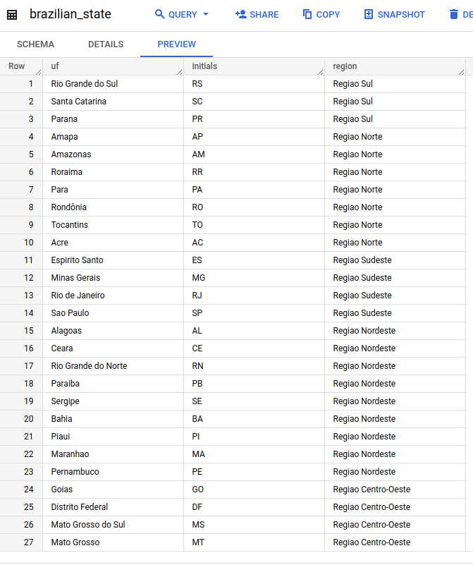
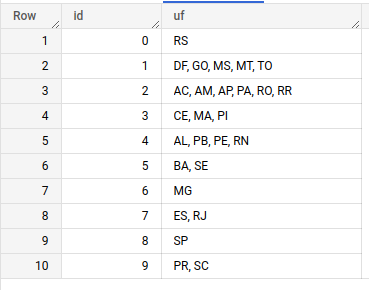

# :rocket: Desafio
Nosso time de negócio precisa analisar dados de alguns usuários para tomada de decisões futuras

O desafio é capturar os dados que recebemos de alguns usuários e conseguir responder perguntas que definirão os próximos passos da empresa!
 
## Tarefas
**Documentações da API**
- [Swagger UI](https://begrowth.deta.dev/docs)
- [ReDoc](https://begrowth.deta.dev/redoc)
### 1. Cadastrar usuário para obter token de acesso da API :key:

**Request Address**: `https://begrowth.deta.dev/user/`

**Request Method** `POST`

**Request Parameters JSON**:
```
{
  "full_name": "string",
  "email": "user@example.com"
}
```

Preencha `full_name` com seu nome completo e `email` com seu email


**Curl**
```
curl -X 'POST' \
  'https://begrowth.deta.dev/user/' \
  -H 'accept: application/json' \
  -H 'Content-Type: application/json' \
  -d '{
  "full_name": "Joao Henrique",
  "email": "joao@begrowth.com.br"
}'
```
------
**Server response**

Code: **201**
Response Body: 
``` 
{
  "user": "joao@begrowth.com.br",
  "API Token": "{access_token}"
}
```

### 2. Consumir dados de usuário da API :key:
Substituindo `access_token` pelo token obtido na etapa anterior, podemos chamar o endpoint `https://begrowth.deta.dev/token=access_token` que nos retorna dados de usuários em formato **JSON**

Exemplo:
**Saída**
```
    {
        "id": 125,
        "first_name": "João",
        "last_name": "Almeida",
        "email": "joao@exemplo.br",
        "gender": "Male",
        "address": {
            "geo_latitude": -28.2588438,
            "geo_longitude": -53.5009992,
            "country": "Brazil"
        },
        "utm": "br-gg-cc",
        "cpf": "gAAAAABjieY90eD1zlPMbL92LLt-f6j5-apLacUZRGPncA9xDS99y1GunWtI9X2OfzMRsjDwNOk7Kya1Zd6l7WmcfJBUpqCIbw=="
    }
```


| Campo | Descrição |
| :---  | :---      |
| **ID**| identificador único do usuário |
| **first_name** | primeiro nome do usuário |
| **last_name** | último nome do usuário |
| **email** | email que o usuário cadastrou |
| **address** | dados de acesso do usuário |
| **address.geo_latitude** | latitude de acesso do usuário |
| **address.geo_longitude** | longitude de acesso do usuário |
| **address.country** | país de acesso do usuário |
| **utm** | define o fluxo de acesso (**vide legenda abaixo**) |
| **cpf** | CPF criptografado do usuário |


Para o campo **utm** (Urchin Traffic Monitor) temos os seguintes dominios validos, que sempre terá a estrutura [país]-[source]-[vertical]:

`br-gg-emp, br-gg-cc, br-gg-fin, br-fb-emp, br-fb-cc, br-wpp-fin`

**Legenda:**


| sigla | País      |
| :---  | :---      |
|**br** | Brazil    |


| sigla   | Source   |
| :---    | :---     |
|**gg**   | Google   |
|**fb**   | Facebook |
|**wpp**  | WhatsApp |


| sigla   | Vertical          |
| :---    | :---              |
|**emp**  | Emprestimo        |
|**cc**   | Cartão de Credito |
|**fin**  | Financiamento     |


**Exemplo:**

O `utm = br-fb-emp` significa que o usuário pertence ao:
* País = br = Brazil
* Source = fb = Facebook
* Vertical = emp = Emprestimo


### 2. Transformar e tratar os dados em um dataframe com Python
Para ajudar o time de produto em suas análises, precisamos que os dados estejam formatados e com seu data type correto
 
**Regras de negócio**
* **2.1 -** Precisamos saber o estado que a pessoa acessou nossos serviços, com as coordenadas `address.geo_latitude` e `address.geo_longitude` dos usuários devemos criar uma coluna de estado chamada `address_state`, processo denominado [reverse geocode](https://en.wikipedia.org/wiki/Reverse_geocoding)
* **2.2 -** a API nos devolve o CPF do usuário, mas temos um problema: o CPF está **criptografado**! :lock: Utilizando a chave de criptografia **Fernet** passada por email, abra esse CPF para que possamos analisar o próximo requisito; :unlock:
* **2.3 -** Para ajudar a identificar registros mais atualizados e para nosso controle de auditoria, precisamos que o dataframe tenha as colunas `dt_insert` que contenha data/hora de inclusão do registro e `candidate_name` que contenha seu nome
 
### 3. Inserir esse dataframe dentro de uma tabela no BigQuery
Deixamos os dados no jeitinho para que eles possam ser armazenados dentro de uma tabela na nossa base de dados.
Utilizando a **service account** enviada por email crie a tabela no banco de dados com a seguinte nomenclatura **bg_data_enginner_test_seuNome**

**Ponto de atenção**: *o BigQuery não aceita colunas com ponto ou caracter especial, precisaremos renomear as colunas que contenham alguns desses casos trocando-os por *underscore* `_`*


Leia sobre [Nomes de coluna BigQuery](https://cloud.google.com/bigquery/docs/schemas#column_names) 
 
### 4. Utilizando consultas SQL responda as perguntas ([Como executar consultas BigQuery com Python](https://cloud.google.com/bigquery/docs/pandas-gbq-migration#running_queries))

* **4.1 -** Quantos **usuários** temos por **estado** de acesso ordenando pelo estado com maior número (coluna `address_state`)?
* **4.2 -** Quantos **usuários únicos** temos por **estado de acesso** ordenando pelo estado com maior número (coluna `address_state`)?
* **4.3 -** Quantos **usuários** temos por **source** ordando por ordem alfabética?
* **4.4 -** Quantos **usuários únicos** temos por **source** ordando por ordem alfabética?

:mag_right: Você sabia que o [nono dígito do CPF corresponde a Região Fiscal emissora do CPF](http://clubes.obmep.org.br/blog/a-matematica-nos-documentos-cpf/)? 

* **4.5 -** Sabendo disso, nosso time precisa saber qual a Região Fiscal que esse CPF foi registrado:


  Para isso disponibilizamos as tabelas:


  **4.5.1 -** `begrowth-user-api-demo.bg_users.brazilian_state` que contem as unidades federativas do Brasil e suas respectivas siglas
  


  **4.5.2 -** `begrowth-user-api-demo.bg_users.cpf_state` que contem o nono dígito do CPF e a Região Fiscal correspondente
  


* **4.6 -** O estado de acesso obtido atraves das coordenadas geograficas fica na mesma Região Fiscal que esse CPF foi registrado? (Criar flag `same_state` no select)
 
### 5. O que esperamos:
* Seu projeto deve estar em um repositório **git**.
* Crie uma documentação que explique como fez para chegar nos resultados obtidos, pode ser no **README** do git.
* Sinta-se à vontade para usar qualquer framework, bibliotecas e ferramentas que se sentir à vontade a única restrição é a linguagem de programação que deve ser **Python**

***Todos os dados de usuário são ficticios gerados para efeito de teste/estudo por plataformas como mockaroo e 4Devs**

**A má utilização dos dados aqui gerados é de total responsabilidade do usuário. Os dados são gerados de forma aleatória, respeitando as regras de criação de cada documento.**
